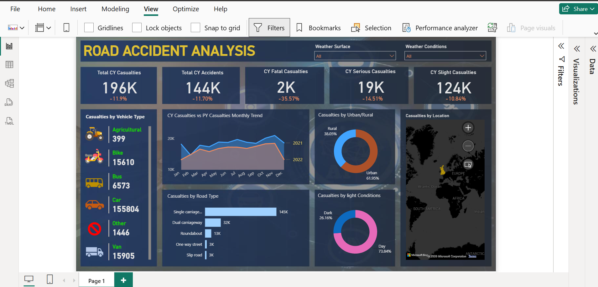

# 🚦 UK Road Accident Dashboard (Power BI)

## 📌 Project Overview

This project presents an interactive Power BI dashboard for analyzing UK road accident data. It helps identify accident trends, casualty statistics, vehicle involvement, and road conditions through dynamic visualizations.

---

## 📊 Dashboard Features

- Total Casualties KPI
- Total Accidents KPI
- Fatal, Serious, and Slight Casualties
- Monthly Casualty Trend (2021 vs 2022)
- Casualties by Vehicle Type
- Casualties by Road Type
- Urban vs Rural Analysis
- Day vs Night Analysis
- Interactive Filters and Slicers

---

## 🛠 Tools & Technologies

- Microsoft Power BI
- Power Query
- DAX
- Data Modeling

---

## 📁 Dataset

The dashboard is built using the UK Road Accident dataset.

---

## 📷 Dashboard Preview

---

## 📌 Key Insights

- Compare accident trends between 2021 and 2022.
- Analyze casualty severity.
- Identify high-risk road types.
- Explore accident distribution by vehicle type.

---

## 👩‍💻 Author

**Amina Arshad**

Computer Science Student

COMSATS University Islamabad, Sahiwal Campus